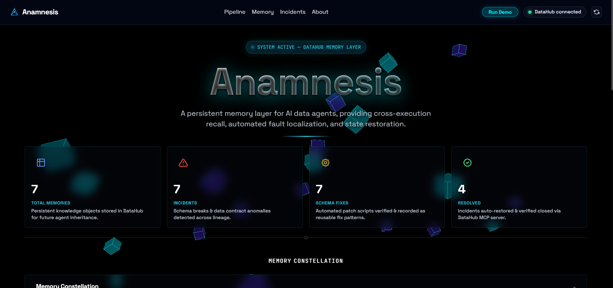
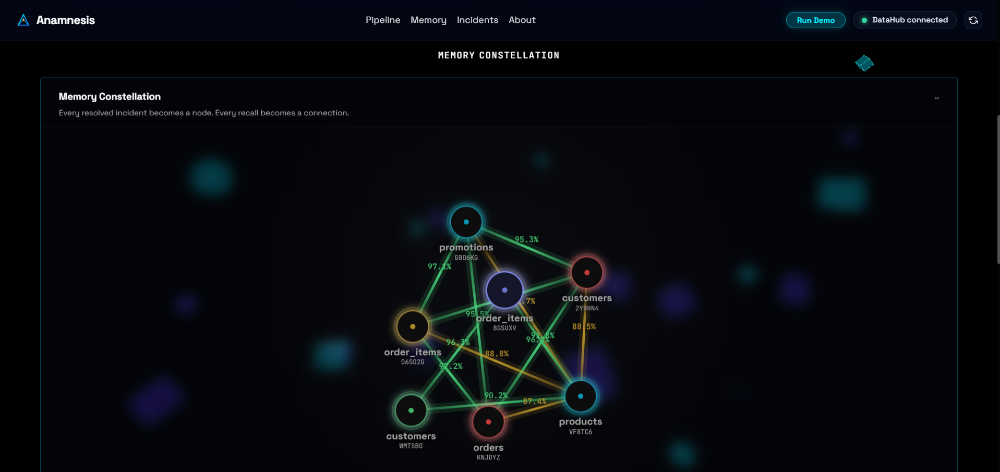
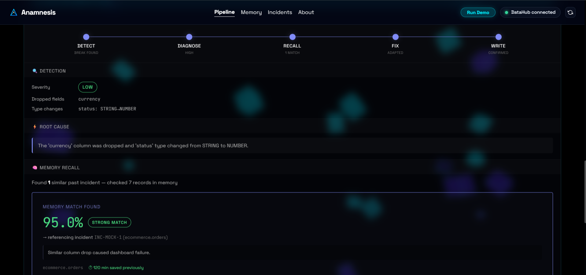
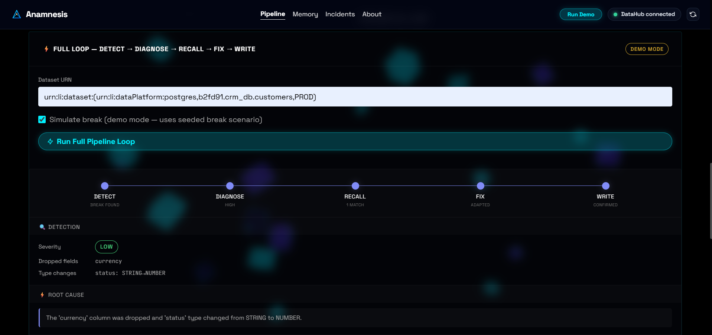
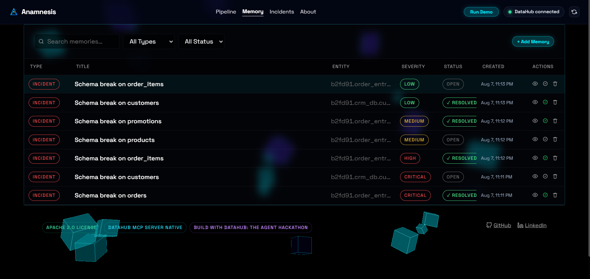
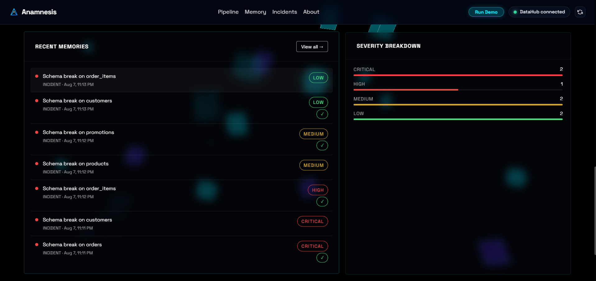
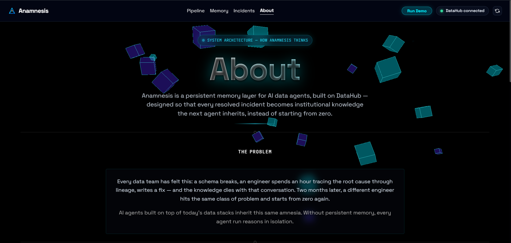

<div align="center">



<br/><br/>

# 🔺 ANAMNESIS

### *A Persistent Memory Layer for AI Data Agents — Built on DataHub*

**Every resolved incident becomes institutional memory the next agent inherits.**

<br/>

[](https://github.com/AmitK241/Anamnesis)
[](https://www.linkedin.com/in/amit-kumar-3a602a289)
[](https://anamnesis-agent.onrender.com/)

<br/>

[](LICENSE.md)
[]()
[]()
[]()

<br/>

> ⚠️ **The badge above links to a hosted UI preview only.** It is not connected to a live DataHub instance (DataHub cannot be reached from a public server without a paid cloud tier), so it will not show real data. **To see Anamnesis actually working — detecting real schema breaks, tracing real lineage, and recalling real memories — please run it locally in under 5 minutes.** See [Setup](#-setup) below. This is exactly what the demo video shows.

</div>

---

## 📋 Table of Contents

- [Executive Summary](#-executive-summary)
- [Product Walkthrough](#-product-walkthrough)
- [Key Features](#-key-features)
- [System Architecture](#️-system-architecture)
- [Understanding the Dashboard](#-understanding-the-dashboard)
- [Tech Stack](#-tech-stack)
- [Setup](#-setup)
- [Roadmap](#️-roadmap)
- [License](#-license)

---

## 🎯 Executive Summary

Every data team has felt this: a schema breaks, an engineer spends an hour tracing the root cause through lineage, writes a fix — and that knowledge dies with the conversation. Two months later, a different engineer (or AI agent) hits the same class of problem and starts from zero again.

**Anamnesis** gives AI data agents a **persistent memory layer**, built directly on top of **DataHub**. Instead of reasoning about schema breaks in isolation, agents equipped with Anamnesis search, recall, and inherit institutional resolution knowledge across every execution run — the same way a senior engineer's experience compounds over years.

<div align="center">

| 🔍 Detect | ⚡ Diagnose | 🧠 Recall | 🛠️ Fix | 💾 Write |
|:---:|:---:|:---:|:---:|:---:|
| Real schema-change detection | Live DataHub lineage tracing | Vector-similarity search | Fresh or adapted resolution | Structured write-back to DataHub |

</div>

---

## 📸 Product Walkthrough

<table>
  <tr>
    <td width="50%">
      <h3 align="center">Memory Constellation</h3>
      <a href="docs/screenshots/memory-constellation.png"></a>
      <p align="center"><i>A force-directed D3.js graph — every resolved incident is a node, every recall is a connecting edge, weighted by real similarity score.</i></p>
    </td>
    <td width="50%">
      <h3 align="center">Vector-Based Recall</h3>
      <a href="docs/screenshots/recall-match.png"></a>
      <p align="center"><i>Genuine semantic similarity search surfacing past incidents — ranked by real embedding distance, not keyword match.</i></p>
    </td>
  </tr>
  <tr>
    <td width="50%">
      <h3 align="center">5-Stage Pipeline Tracker</h3>
      <a href="docs/screenshots/pipeline-flow.png"></a>
      <p align="center"><i>End-to-end pipeline: Detect → Diagnose → Recall → Fix → Write.</i></p>
    </td>
    <td width="50%">
      <h3 align="center">Persistent Memory List</h3>
      <a href="docs/screenshots/memory-list.png"></a>
      <p align="center"><i>Every stored incident — searchable, filterable, and resolvable — backed by DataHub's graph.</i></p>
    </td>
  </tr>
  <tr>
    <td width="50%">
      <h3 align="center">Severity Breakdown</h3>
      <a href="docs/screenshots/severity-breakdown.png"></a>
      <p align="center"><i>Real severity classification across all stored incidents, at a glance.</i></p>
    </td>
    <td width="50%">
      <h3 align="center">System Architecture</h3>
      <a href="docs/screenshots/about-page.png"></a>
      <p align="center"><i>The full pipeline, explained — how every stage reads and writes through DataHub.</i></p>
    </td>
  </tr>
</table>

---

## ✨ Key Features

* 🧠 **Persistent Agent Memory** — every resolved schema break is written back to DataHub as a structured `IncidentMemory` object, read-back verified.
* 🌌 **Memory Constellation** — an interactive D3.js graph showing how incidents relate to each other via real vector similarity.
* 🔍 **Schema Change Detection** — watches real DataHub datasets for schema drift against a captured baseline.
* 🎯 **Lineage-Aware Diagnosis** — traces DataHub's live lineage graph to find genuine downstream impact, not guesswork.
* ⚡ **Adaptive Fixing** — generates a fresh resolution when memory is empty, or adapts a prior fix instantly when a strong match exists.

---

## 🏗️ System Architecture

```text
┌─────────────┐   ┌──────────────┐   ┌───────────────┐   ┌─────────┐   ┌──────────────┐
│   Detector   │──▶│  Diagnoser   │──▶│ Memory-Recall │──▶│  Fixer  │──▶│ Memory-Writer│
│    Agent     │   │    Agent     │   │     Agent     │   │  Agent  │   │    Agent     │
└─────────────┘   └──────────────┘   └───────────────┘   └─────────┘   └──────────────┘
       │                  │                   │                              │
       ▼                  ▼                   ▼                              ▼
              DataHub MCP Server — lineage, schema, vector search, write-back
                              │
                              ▼
                    DataHub Graph (IncidentMemory)
```

Every stage reads and/or writes through DataHub's MCP Server:
- **Read:** schema snapshots, lineage traversal, vector-indexed similarity search
- **Write:** a custom `IncidentMemory` structured object persisted back to the graph after every resolution — so the knowledge compounds with every run, not just this one

---

## 📊 Understanding the Dashboard

| Card | What it counts |
|---|---|
| **Total Memories** | Every record stored in DataHub's memory graph so far. |
| **Incidents** | Of those, how many are genuine resolved problems (`type = INCIDENT`). |
| **Schema Fixes** | Of those, how many carry the more specific `SCHEMA_FIX` tag. |
| **Resolved** | Of all records, how many have been marked `RESOLVED` via the Memory view. |

---

## 🧰 Tech Stack

<div align="center">


</div>

*(Verify this list against your actual `requirements.txt` before final submission.)*

---

## 🚀 Setup

### Prerequisites
- Docker Desktop (for local DataHub)
- Python 3.10+

### 1. Clone and install
```bash
git clone https://github.com/AmitK241/Anamnesis.git
cd Anamnesis
python3 -m venv .venv
source .venv/bin/activate   # Windows: .venv\Scripts\activate
pip install -r backend/requirements.txt
```

### 2. Start DataHub locally
```bash
pip install acryl-datahub
datahub docker quickstart
datahub datapack load showcase-ecommerce
```

### 3. Configure environment
Create a `.env` file in the project root:
```
DATAHUB_GMS_SERVER=http://localhost:8080
DATAHUB_GMS_TOKEN=<your personal access token from DataHub UI → Settings → Access Tokens>
```

### 4. Run the backend
```bash
cd backend
uvicorn main:app --reload --port 8000
```

### 5. Run the frontend
```bash
cd frontend
python3 -m http.server 8888
```

Open **http://localhost:8888** in your browser.

### 6. (Optional) Seed the demo scenario
```bash
python backend/seed_demo_data_v2.py
```

---

## 🗺️ Roadmap

This hackathon submission focuses on schema-break resolution and cross-incident recall to keep the demo tight and fully verified end-to-end. The same `IncidentMemory` framework is designed to extend to:

- **PR-review memory** — recalling how similar code changes were reviewed previously
- **ML-drift memory** — connecting upstream schema changes to downstream model degradation via DataHub's ML lineage
- **Migration memory** — recalling how similar schema migrations were planned and executed

---

## 📄 License

Apache 2.0 — see [LICENSE.md](LICENSE.md)

<div align="center">

### 👤 Author

**Amit Kumar**
[](https://github.com/AmitK241)
[](https://www.linkedin.com/in/amit-kumar-3a602a289)

**Built for Build with DataHub: The Agent Hackathon 2026**

</div>
